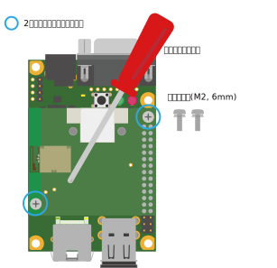
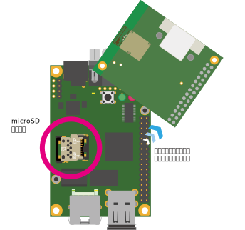

# Deguゲートウェイ A6

[アットマークテクノ製 Deguゲートウェイ A6](https://armadillo.atmark-techno.com/degu-a6) は、[Armadillo-640](https://armadillo.atmark-techno.com/armadillo-640)をベースに、専用のソフトウェアパッケージとArmadillo-600シリーズThreadオプションモジュールを搭載したDeguゲートウェイです。

## 外観


|番号|名称                          |説明                                                              |
|----|------------------------------|------------------------------------------------------------------|
|1   |USBコネクタ                   |USBメモリ等を接続します(※蓋をされている上段は使用できません)     |
|2   |LANコネクタ                   |LANケーブルを接続します                                           |
|3   |LANリンクアクティビティLED(黄)|LANポートが使用可能な時に点灯し、データが送受信されると点滅します |
|4   |LANスピードLED(緑)            |100Mbpsで接続されていると点灯し、ケーブルが未接続だと消灯します   |
|5   |ユーザーLED(赤)               |ユーザーで自由に機能を設定できるLEDです                           |
|6   |ユーザーLED(緑)               |ユーザーで自由に機能を設定できるLEDです                           |
|7   |ユーザースイッチ              |ユーザーで自由に機能を設定できるスイッチです                      |
|8   |シリアルコネクタ              |シリアルクロスケーブルを接続します                                |
|9   |電源コネクタ                  |付属のACアダプタを接続します                                      |


## 接続方法
Deguゲートウェイ A6と周辺装置の接続例を次に示します。


## Armadillo-640 製品マニュアルの適用範囲

有線 LAN の使用方法など、Armadillo-640との差分が無い箇所については、[Armadillo-640 製品マニュアル](https://users.atmark-techno.com/armadillo-640/manual)の内容が適用できます。

Deguゲートウェイ A6から見たArmadillo-640との差分は次の通りです。

* Armadillo-600シリーズThreadオプションモジュールを搭載しています
* CON1(SDインターフェース)は[復旧手順](#seq_recovery)以外に使用できません
* CON3(シリアルインターフェース)をコンソールとして使用します
* CON5(USB ホストインターフェース)の上段が使用できません
* インストールディスクとしてUSBメモリを使用します
* 次のイメージファイルが異なります
  * インストールディスクイメージ
  * ブートローダー
  * DTB (Device Tree Blob)
  * ルートファイルシステム


## <a name="seq_install">インストール手順</a>

インストールディスクを使用すると、内蔵ストレージ上のすべてのイメージをまとめて書き換えることができます。Deguゲートウェイ A6のソフトウェアインストール手順を以下に示します。USBメモリは512MB以上の容量が必要です。

1. インストールディスクの作成

    USBメモリがマウントされている場合は事前にアンマウントしてから、USBメモリにインストールディスクイメージを書き込みます。

    ```
    [ATDE]# sudo dd if=install-disk-degugw-a6-[version].img of=/dev/sdx bs=4M conv=fsync
    ```

2. インストールディスクの接続

    Deguゲートウェイ A6の電源が切断されていることを確認し、USBメモリを接続します。

3. インストールの実行

    ユーザースイッチを押しながら電源を投入します。

    次のように "run usbboot" コマンドを実行するとインストールが始まります。


    ```
    => run usbboot
    ```

    次のようにメッセージが表示されるとインストール完了です。電源を切断し、USBメモリを取り外してください。

    ```
    *+*+* Install Completed!! *+*+*
    ```

## <a name="seq_recovery">復旧手順</a>

不測の事態により、Deguゲートウェイ A6のブートローダーを破壊してしまった場合の復旧手順を以下に示します。SDカードは512MB以上の容量が必要です。

ブートローダーが起動できる場合は、この手順を実行しないでください。ソフトウェアの初期化やアップデートは、[インストール手順](#seq_install)を参照してください。

1. インストールディスクの作成

    SDカードがマウントされている場合は事前にアンマウントしてから、SDカードにインストールディスクイメージを書き込みます。

    ```
    [ATDE]# sudo dd if=install-disk-degugw-a6-[version].img of=/dev/sdx bs=4M conv=fsync
    ```

2. インストールディスクの接続

    Deguゲートウェイ A6の電源が切断されていることを確認し、Deguゲートウェイ A6ケースのネジを外して開けます。

    

    Armadillo-600シリーズThreadオプションモジュールのネジを外します。

    

    Armadillo-600シリーズThreadオプションモジュールを取り外して、SDカードを接続します。

    

    JP1 と JP2 を共にジャンパでショートします。

    

3. インストールの実行

    ユーザースイッチを押しながら電源を投入します。

    次のように "boot" コマンドを実行するとインストールが始まります。


    ```
    => boot
    ```

    次のようにメッセージが表示されるとインストール完了です。

    ```
    *+*+* Install Completed!! *+*+*
    ```

    電源を切断し、次の作業を行います。

    * JP1 と JP2の取り外し
    * SDカードの取り外し
    * Armadillo-600シリーズThreadオプションモジュールの組み立て
    * ケースの組み立て
